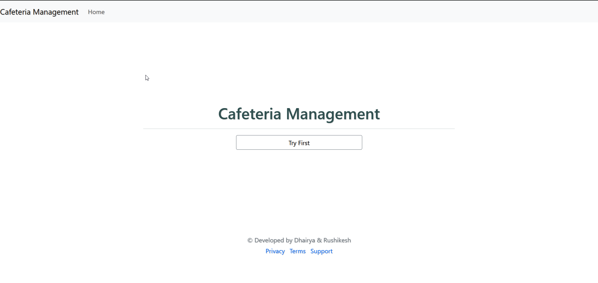
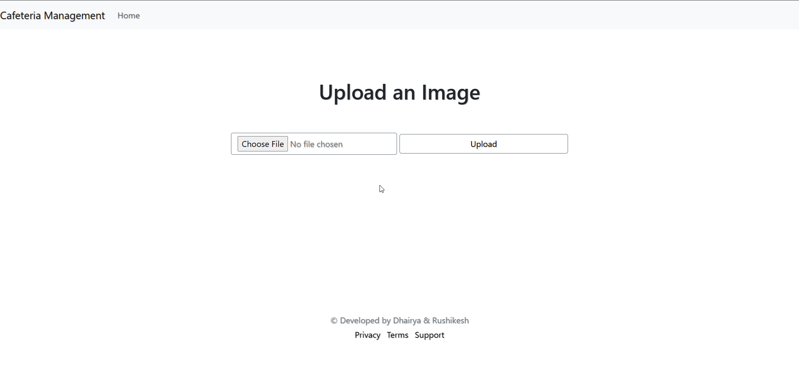
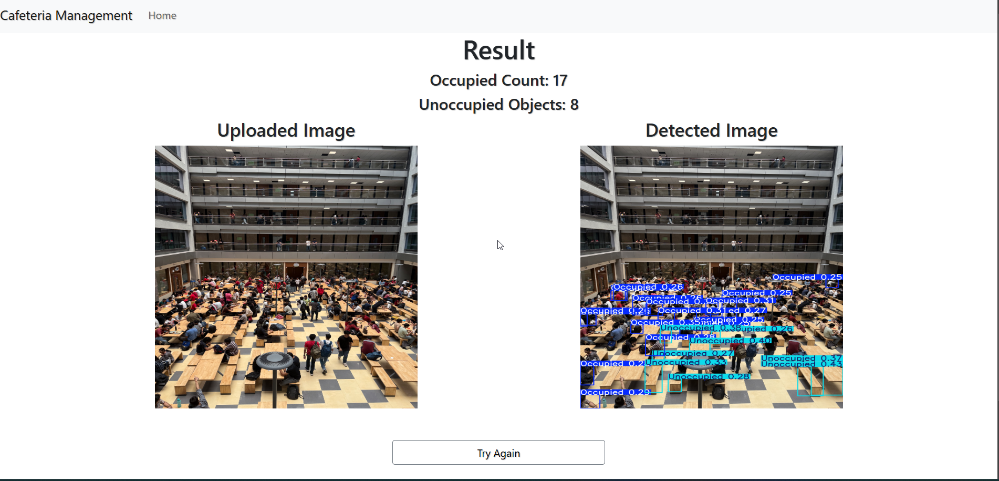

# Project: Cafeteria Management Using Video Analytics!

[Project Demo](https://dhairyakhania-cafeteria-management-using-video-analytics.hf.space/)

The main goal of Cafeteria Management Using Video Analytics is to improve the efficiency, safety, and overall experience in cafeteria settings through the use of video surveillance and advanced data analytics. By leveraging video analytics technologies, such as computer vision and machine learning, cafeteria management systems can achieve a variety of objectives.





## Importance of the Project
- **Enhanced Operational Efficiency**: Video analytics helps optimize customer flow, seating arrangements, and staff productivity, improving overall cafeteria efficiency.
- **Improved Safety and Security**: It enables real-time monitoring for detecting suspicious behavior, safety hazards, and ensuring compliance with safety protocols.
- **Customer Experience Optimization**: Analyzing customer behavior and preferences allows for tailored services, reducing wait times and enhancing satisfaction.
- **Data-Driven Decision Making**: Provides valuable insights through data analytics, helping managers make informed decisions about staffing, inventory, and menu offerings.
- **Inventory and Resource Management**: Helps track stock levels and ensures efficient resource use, minimizing wastage and ensuring timely restocking.
- **Compliance Monitoring**: Assists in monitoring hygiene, food safety practices, and regulatory compliance, ensuring a safe and healthy environment for both staff and customers.

## Technical Overview
- **Deep Learning Frameworks**: Utilizes popular frameworks like YoloV8 for building and training the computer vision model.
- **Git Integration**: For source code management and version control, making the project easily maintainable and scalable.
- 
# How to run?
### STEPS:

Clone the repository

```bash
https://github.com/Dhairyakhania/Cafeteria_Management.git
```

### STEP 01- install the requirements
```bash
pip install -r requirements.txt
```
### STEP 02- Model Training
```bash
#run this file to generate the models

Run the FinalVideoAnalytics.ipynb file present in Code branch
```



Now run,
```bash
python app.py for frontend
```
